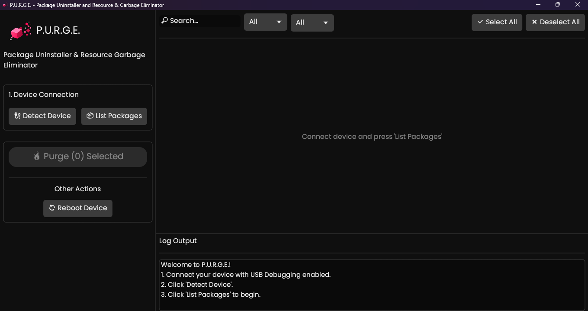

// README.md

  
  
  
  

> [!WARNING] > **Use at your own risk!** 💀 This is powerful software. I am not responsible for anything that could happen to your phone. Always make a full backup of your data before proceeding.

  <em>Say goodbye to bloatware with a slick, modern, and native GUI!</em>

---

## 📖 Summary

Welcome to **P.U.R.G.E.**! 📱 This is a native debloater GUI built from scratch in Rust and `egui` for a fast, responsive, and truly cross-platform experience. Our mission is to help you reclaim your device's privacy and battery life by making it dead simple to remove unnecessary system apps. A leaner device also means a smaller [attack surface](https://en.wikipedia.org/wiki/Attack_surface), hardening your security.

Packages are documented to give you a clear idea of what's safe to remove. The worst-case scenario is a bootloop, but don't panic! After about 5 failed boots, your phone will enter recovery mode, where you can perform a factory reset.

**Bottom line: You CANNOT permanently brick your device with this software!**

---

## ✨ Features

- **🚀 Blazing Fast & Feather-Light:** Built with native Rust for instant startup and minimal resource usage. No sluggish Electron apps here!
- **🎨 Polished & Modern UI:** A beautiful, non-blocking interface with a logical layout, clear action buttons, and helpful icons.
- **📊 Visual Progress Bar:** Never get left in the dark. A progress bar shows you exactly how much work is left during a purge.
- **📦 All-In-One Executable:** The required ADB binaries for Windows and Linux are embedded directly into the app. Zero setup required!
- **💻 Genuinely Cross-Platform:** One codebase that compiles and runs flawlessly on both Windows and Linux.
- **🔍 Find Anything, Instantly:** A compact control bar lets you search, filter by list (`Recommended`, `Advanced`), and sort by removal status.
- **ℹ️ Know Before You Nuke:** View detailed descriptions, dependencies, and other critical info for each package before you hit uninstall.

---

## 📚 Debloat Lists

This tool stands on the shoulders of giants, using the meticulously researched package lists from the original UAD project. It covers dozens of manufacturers and major mobile carriers.

---

## 🛠️ How To Use It

#### Step 1: Prep Your Phone 📱

1.  **BACKUP YOUR DATA!** Seriously. Do it.
2.  **Enable Developer Options:** Go to `Settings > About Phone` and tap `Build Number` 7 times. You're a developer now!
3.  **Enable USB Debugging:** Find the new `Developer Options` menu and toggle on `USB Debugging`.

#### Step 2: Use The App 🖥️

1.  **Download P.U.R.G.E.:** Grab the latest release for your OS from the [**Releases Page**](https://github.com/Md-Siam-Mia-Code/UAD-Universal-Android-Debloater/releases).
2.  **Connect Your Phone:** Plug your device into your computer. A prompt to "Allow USB debugging" will appear on your phone. Check "Always allow" and tap "Allow".
3.  **Launch P.U.R.G.E.:** Double-click the executable.
4.  **Find Your Packages:**
    - In the sidebar, click **`🔌 Detect Device`**, then **`📦 List Packages`**.
    - The main panel will fill up with all the bloatware found on your phone.
5.  **Select & Destroy:**
    - Use the **Search** and **Filter** controls at the top of the list to find your targets.
    - Check the box next to any package you want to obliterate.
    - When you're ready, smash the big **`🔥 Purge`** button in the sidebar.
6.  **Reboot & Enjoy:** Click **`🔄 Reboot Device`** to restart your phone and enjoy a cleaner, faster experience!

> **P.S.** Your phone manufacturer might reinstall bloatware after a major system update. Just run this tool again to clean it up!

---

## 🏗️ Building From Source

1.  **Install Rust:** `https://rustup.rs/`
2.  **Install build dependencies** (for Linux).
3.  **Clone the Repo** and `cd` into it.
4.  **Run with Cargo:** `cargo run --release`

---

## 🙏 Acknowledgements & Credits

This project would not be possible without the incredible work done by the original **Universal Android Debloater** team and its contributors, especially **0x192**, for researching and maintaining the package data.

---

## 📄 License

This project is licensed under the MIT License. See the [LICENSE.md](LICENSE.md) file for details.
