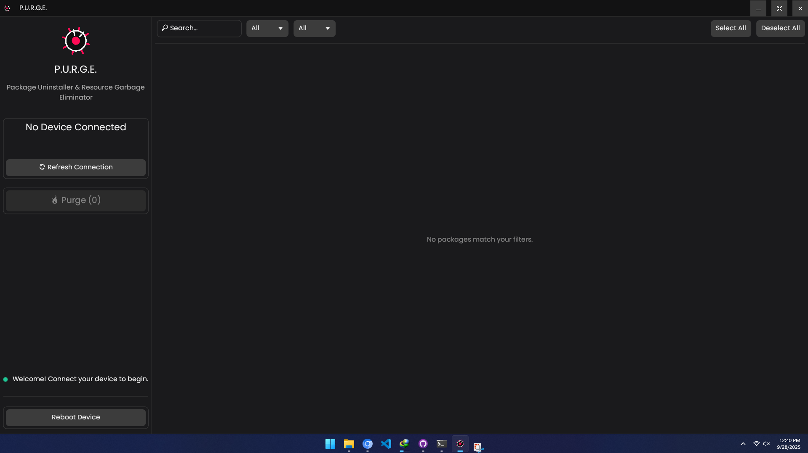

// README.md

<p align="center"></p>

<p align="center">
  
  
  
</p>

> [!WARNING] > **Use at your own risk.** I am not responsible for anything that could happen to your phone. Always make a backup of your data before proceeding.



---

## 📖 Summary

This is a graphical interface for the Universal Android Debloater, built from the ground up in Rust with `egui` for a fast, responsive, and cross-platform experience. It aims to improve privacy and battery performance by making it easy to remove unnecessary and obscure system apps. This can also contribute to improving security by reducing the device's [attack surface](https://en.wikipedia.org/wiki/Attack_surface).

Packages are documented as well as possible to provide a better understanding of what you can safely remove. The worst issue that could happen is removing an essential system package needed during boot, causing an unfortunate bootloop. **Make a backup first!** After about 5 failed system boots, the phone will automatically enter recovery mode, where you may need to perform a factory reset.

In any case, you **CANNOT** permanently brick your device with this software!

---

## ✨ Features

- **🚀 Blazing Fast:** Built with native Rust for maximum performance and minimum resource usage.
- **🎨 Modern & Clean UI:** An intuitive and aesthetically pleasing interface built with the `egui` framework.
- **🔍 Powerful Filtering:** Instantly search for packages by name, or filter by list type (`Recommended`, `Advanced`, etc.) and removal status.
- **ℹ️ Detailed Information:** View descriptions, dependencies, and other critical information for each package before removal.
- **📦 Self-Contained:** The required ADB binaries are embedded directly into the application. **No need to install ADB on your system!**
- **💻 Cross-Platform:** Single codebase that compiles and runs on Windows, macOS, and Linux.

---

## 📚 Debloat Lists

This tool uses the extensive and well-researched package lists from the original UAD project.

#### Universal Lists

- [x] GFAM (Google/Facebook/Amazon/Microsoft)
- [x] AOSP
- [x] Manufacturers (OEM)
- [x] Mobile carriers
- [x] Qualcomm / Mediatek / Miscellaneous

#### Manufacturers Lists

- [x] Archos
- [x] Asus
- [x] Blackberry
- [x] Gionee
- [x] LG
- [x] Google
- [x] iQOO
- [x] Fairphone
- [x] HTC
- [x] Huawei
- [x] Motorola
- [x] Nokia
- [x] OnePlus
- [x] Oppo
- [x] Realme
- [x] Samsung
- [x] Sony
- [x] Tecno
- [x] TCL
- [x] Unihertz
- [x] Vivo/iQOO
- [x] Wiko
- [x] Xiaomi
- [x] ZTE

#### Mobile Carriers Lists

| Country | Carriers                        |
| ------- | ------------------------------- |
| France  | Orange, SFR, Free, Bouygues     |
| USA     | T-Mobile, Verizon, Sprint, AT&T |
| Germany | Telekom                         |
| UK      | EE                              |

---

## 🛠️ How To Use It

#### Step 1: Prepare Your Phone

1.  **Backup Your Data!** You can never be too careful. Use your phone manufacturer's backup tool or any other method you prefer.
2.  **Enable Developer Options:** On your smartphone, go to `Settings > About Phone` and tap on `Build Number` 7 times.
3.  **Enable USB Debugging:** Find the new `Developer Options` menu in your settings and turn on `USB Debugging`.
4.  **(Optional but Recommended)** Disconnect from any OEM accounts (e.g., Samsung Account, Mi Account). Sometimes, removing an account package can cause issues on the lockscreen.

#### Step 2: Use the Application

1.  **Download UAD-Rust:** Grab the latest executable for your operating system from the [**Releases Page**](https://github.com/Md-Siam-Mia-Code/UAD-Universal-Android-Debloater/releases).
2.  **Connect Your Phone:** Connect your device to your computer with a USB cable. A prompt will appear on your phone asking you to "Allow USB debugging". Check "Always allow from this computer" and tap "Allow".
3.  **Launch UAD-Rust:** Run the downloaded executable.
4.  **Detect and List Packages:**
    - Click **`1. Detect Device`**. The log panel should show your device's serial number.
    - Click **`2. List Packages`**. The main panel will populate with all the system apps found on your device that are on the debloat lists.
5.  **Select and Uninstall:**
    - Use the **Search** and **Filter** options on the left to find packages.
    - Click the checkbox next to any package you wish to remove.
    - When ready, click the **`Uninstall Selected (#)`** button.
6.  **Reboot:** Once finished, you can click **`Reboot Device`** to restart your phone.

> **IMPORTANT NOTE:** You may need to run this software again after your phone receives a major system update (from your OEM), as some uninstalled system apps might be reinstalled.

---

## 🏗️ Building From Source

1.  **Install Rust:** `https://rustup.rs/`
2.  **Clone the Repository:**
    ```bash
    git clone https://github.com/Md-Siam-Mia-Code/UAD-Universal-Android-Debloater.git
    cd UAD-Universal-Android-Debloater
    ```
3.  **Build & Run:**
    ```bash
    # For a release (optimized) build
    cargo run --release
    ```

---

## 🙏 Acknowledgements & Credits

This project would not be possible without the incredible work done by the original **Universal Android Debloater** team.

The comprehensive package lists (`uad_lists.json`) are sourced directly from their repository. All credit for the monumental task of researching and maintaining this data goes to **0x192** and the contributors to the original project. We also thank them for the clear and concise user warnings and documentation which we have adapted for this README.

- **Original Project:** [0x192/universal-android-debloater](https://github.com/0x192/universal-android-debloater)
- **Source for `uad_lists.json`:** [Link to JSON file](https://github.com/0x192/universal-android-debloater/blob/main/resources/assets/uad_lists.json)
- **Original Project Wiki & FAQ:** [Link to Wiki](https://github.com/0x192/universal-android-debloater/wiki)

---

## 🤝 Contributing

Contributions are welcome! If you have ideas for new features, bug fixes, or improvements, feel free to open an issue or submit a pull request.

---

## 📄 License

This project is licensed under the MIT License. See the [LICENSE.md](LICENSE.md) file for details.
